# Inventory management

An `inventory management` project with angular and .net core apis.

## When have I started it and feature upgrades?

- I have built this project in **early 2024** with `.net 8 ` and `angular 17`. I had created two separate github repositories for `front-end` and `backend`. Now, I have moved them to a single repository.
- I have upgraded it to `.NET 9` and `Angular 20`.
- I have used `sql server 2022` as a database. I have used `stored procedures` in all the places. I have taken a challange and migrated it to `PostgreSQL` to see how comfortable am I with Postgres without entity framework and what challanges we face during migrations. It was not easy but fun ride.
- I also have added feautres like `suppliers` and `authentication`.
- I have added `entity framework core` for future updates and specially for migrations. I use two machines back and forth and **it was hard to maintain both dev databases**. Entity framework migrations helped me with that. Howeverm I haven't used it anywhere yet. May be I will use it authentication feature (yeah, I am working on this feature).

## Tech Stack

- **Backend:** Asp.net core web api (9.0) (upgrade from .net 8)
- **Database:** Postgres (previously sql server 2022)
- **ORM:** Dapper(Most of the places), EF Core
- **Frontend:** Angular 20  (upgraded from v18)
- **UI:** Angular material (UI component library)
- **State Management:** `Ngrx componnent store` (Almost everywhere) and `service with signal` (For newer features).

## Run this project with docker (coming soon)

## To run this project in dev environment

- Make sure you have installed `dotnet 9.0` sdk, a latest version node js and angular cli.
- **Clone this project:** Open a terminal and run `git clone https://github.com/rd003/InventroyMgt.git`
- `cd `
- With command `code .`, your project will be opened in VS Code.
- You need to run both projects separately:

### A. Backend

1. Open `appsettings.json` and configure the connection string according to your database.
2. Open `InventoryMgt.Api` in the integrated terminal.
3. Execute the command `dotnet run`, to run this project. It will automatically generate the database and seed some data

### B. Front-end

1. Open the another integrated terminal (keep the terminal open, where your backend project is running).
2. Execute the command `npm i` to install all the dependencies.
3. Execute `ng serve --open` to run and open this project in browser.
4. A login screen will popup and you need to enter these credentials:

```txt
Username: admin
password: Admin@123
```

## Are you facing problems on migrations?

You might get error while executing them using ` dot net CLI`, because we have multiple projects. You won't face this problem while using `Package Manage Console` of `Visual Studio`.

Error might be something like this:

```txt
Unable to create a 'DbContext' of type 'RuntimeType'. The exception 'Unable to resolve service for type 'Microsoft.EntityFrameworkCore.DbContextOptions`1[InventoryMgt.Data.models.AppDbContext]' while attempting to activate 'InventoryMgt.Data.models.AppDbContext'.' was thrown while attempting to create an instance. For the different patterns supported at design time, see https://go.microsoft.com/fwlink/?linkid=851728
```

Visit to the root directory of backend project, which named `backend` in our case. So visit to `backend` directory and execute these commands in a sequece:

**Creating migration:**

```sh
dotnet ef migrations add SomeMigration --project InventoryMgt.Data --startup-project InventoryMgt.Api
```

Note: You need to replace `SomeMigration` to a meaningful name.

**Update database:** However, this project can apply migration while you run it. But, in case you manually want to run it. 

```sh
dotnet ef database update --project InventoryMgt.Data --startup-project InventoryMgt.Api
```
---

## Screenshots

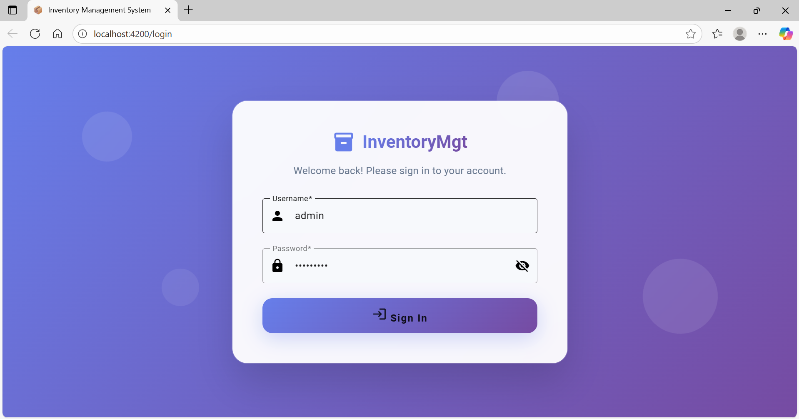

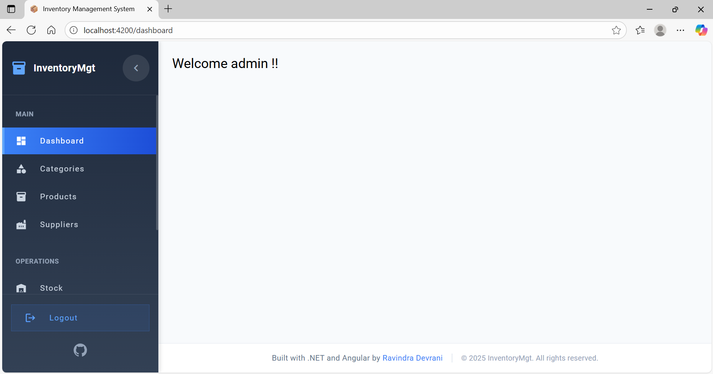

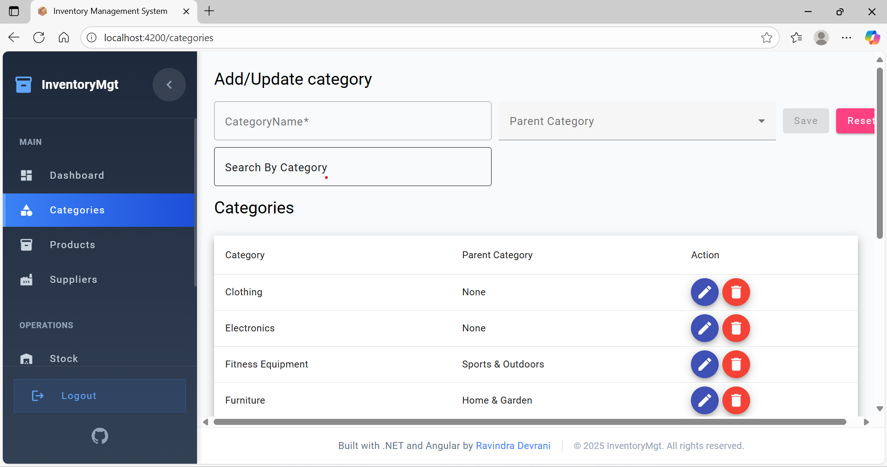

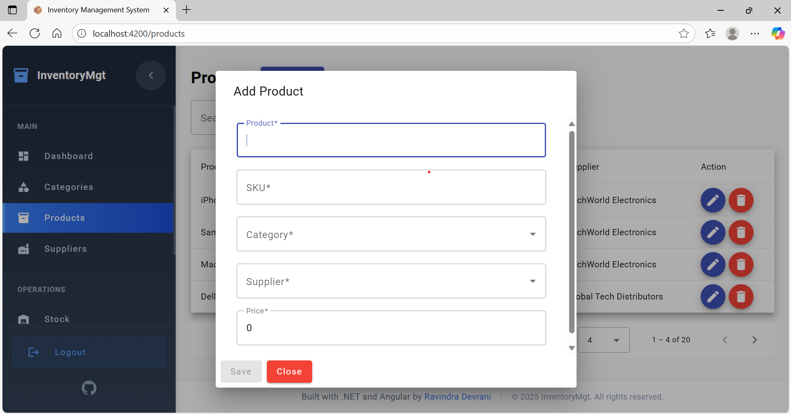

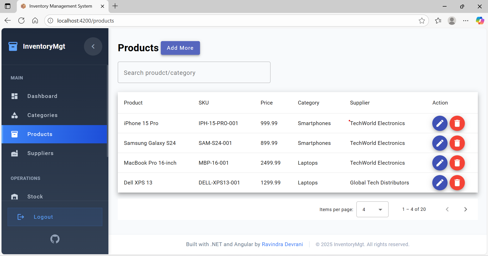

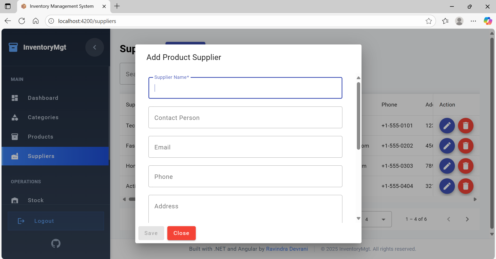

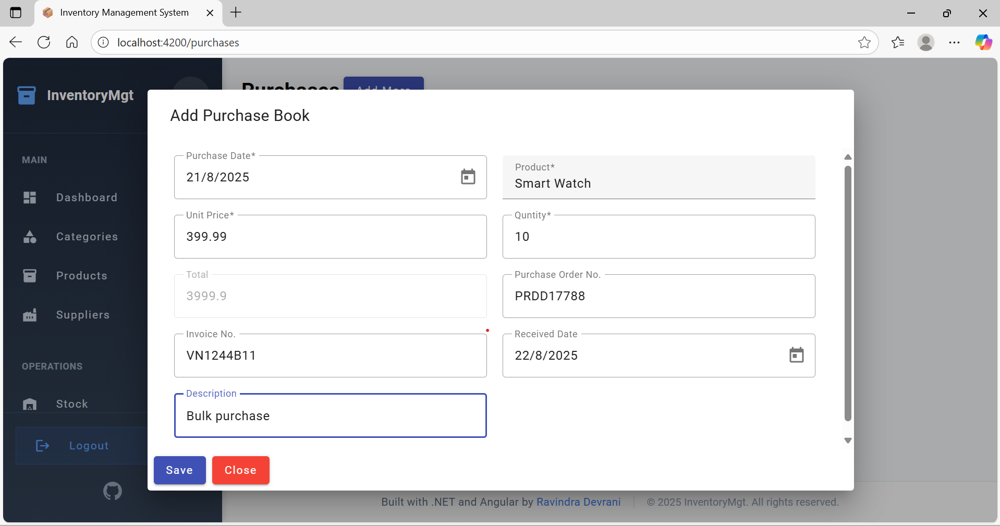

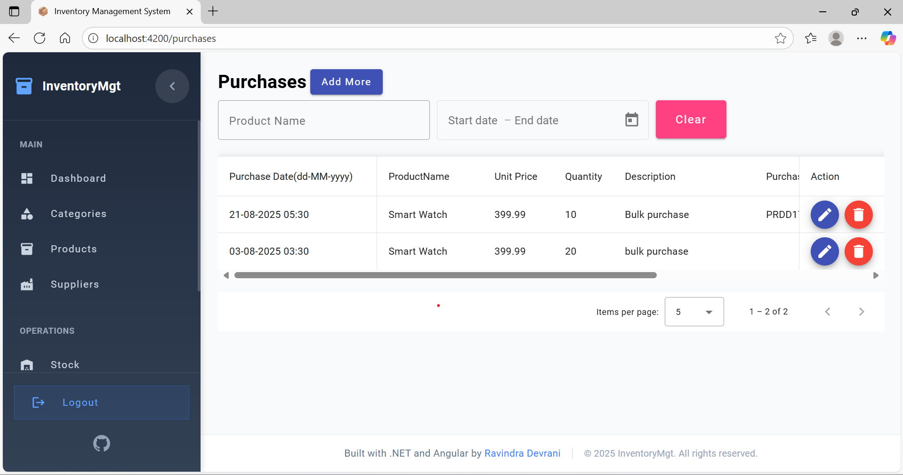

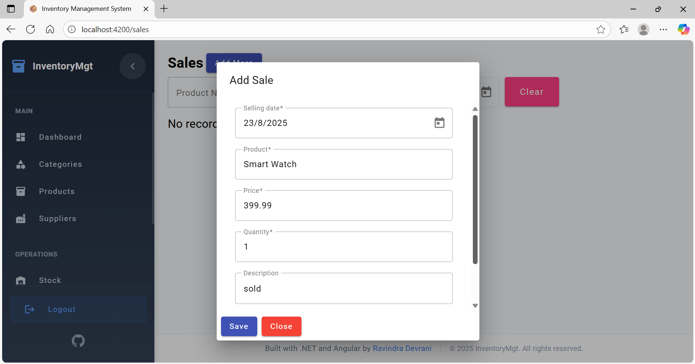

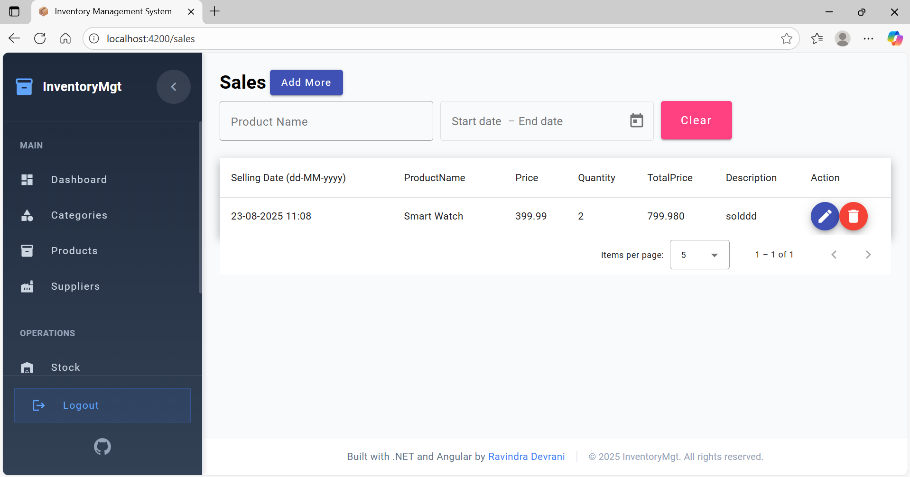

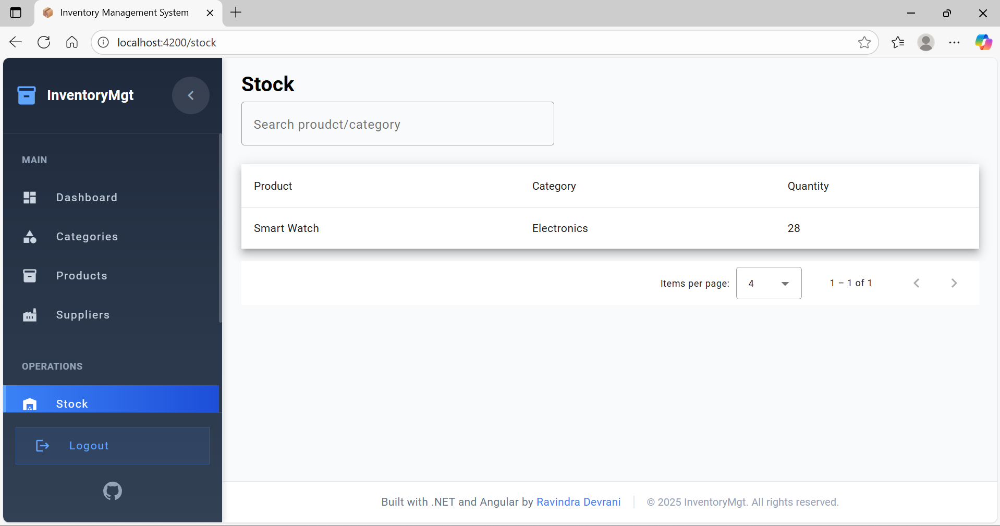

--- 

A Github ⭐ is appreciated 🙂.
